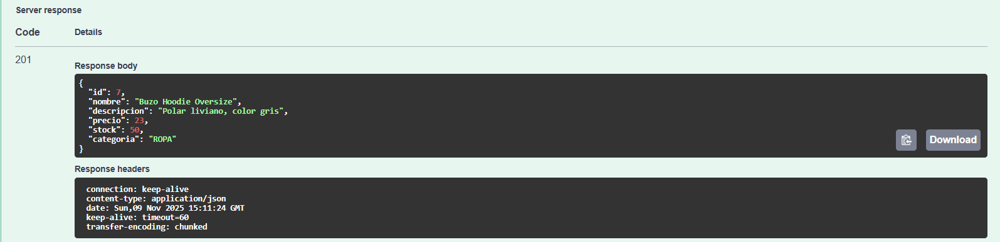
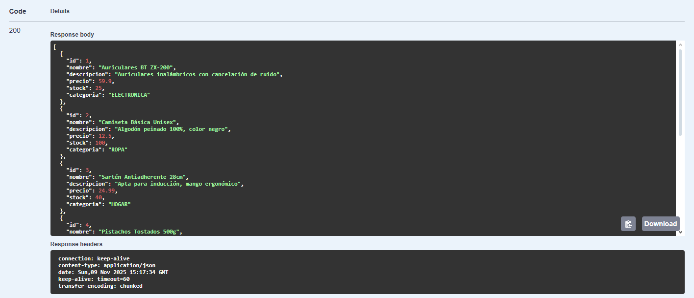
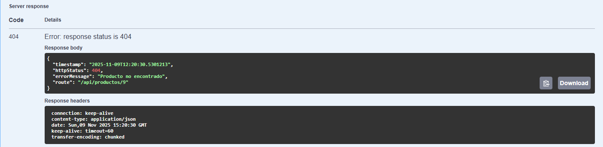
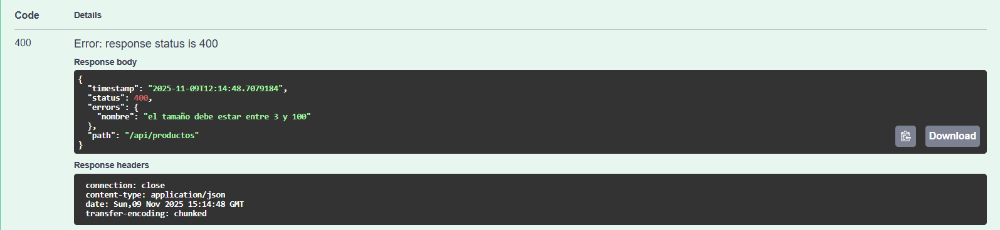
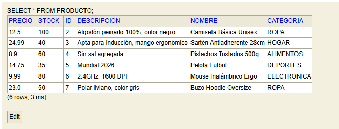

# API de Productos - Spring Boot

## 📝 Descripción del proyecto

Esta es una API RESTful desarrollada en Spring Boot que permite la gestión de un inventario de productos. Expone endpoints para operaciones CRUD (Crear, Leer, Actualizar, Eliminar) sobre los productos, permitiendo también listarlos y filtrarlos por categoría.

El proyecto utiliza una base de datos en memoria H2 para persistencia de datos y está documentado con Swagger (SpringDoc) para facilitar la visualización y prueba de los endpoints.

## ⚙️ Tecnologías utilizadas

El proyecto está construido con Java 21 y Maven, e implementa las siguientes tecnologías y librerías principales:

* **Spring Boot:** Framework principal para la creación de la aplicación.
* **Spring Web:** Para la creación de los controladores RESTful.
* **Spring Data JPA:** Para la persistencia de datos y comunicación con la base de datos.
* **H2 Database:** Base de datos en memoria para desarrollo y pruebas.
* **SpringDoc (Swagger UI):** Para la documentación automática y prueba de la API.
* **Bean Validation:** Para las validaciones de los DTOs de entrada.
* **Lombok:** Para reducir el código boilerplate (getters, setters, etc.).

## 🚀 Instrucciones para clonar y ejecutar

1.  Clona este repositorio en tu máquina local:
    ```bash
    git clone [https://github.com/TU_USUARIO/TU_REPOSITORIO.git](https://github.com/TU_USUARIO/TU_REPOSITORIO.git)
    ```

2.  Navega al directorio raíz del proyecto:
    ```bash
    cd tp-apis-rest-springboot-rossello-51075
    ```

3.  Ejecuta el proyecto utilizando el wrapper de Maven:
    * En macOS/Linux:
        ```bash
        ./mvnw spring-boot:run
        ```
    * En Windows:
        ```bash
        mvnw.cmd spring-boot:run
        ```

4.  La aplicación se ejecutará en `http://localhost:8080`.

## 🌐 Tabla de endpoints

La API expone los siguientes endpoints para interactuar con los productos:

| Método | Ruta | Descripción |
| :--- | :--- | :--- |
| `GET` | `/api/productos` | Lista todos los productos disponibles. |
| `GET` | `/api/productos/{id}` | Obtiene un producto específico por su ID. |
| `GET` | `/api/productos/categoria/{categoria}` | Filtra y lista los productos que pertenecen a una categoría. |
| `POST` | `/api/productos` | Crea un nuevo producto. |
| `PUT` | `/api/productos/{id}` | Actualiza un producto existente (reemplazo completo). |
| `PATCH` | `/api/productos/{id}/stock` | Actualiza únicamente el stock de un producto. |
| `DELETE` | `/api/productos/{id}` | Elimina un producto por su ID. |

## 📸 Capturas de pantalla de Swagger UI

### Documentación completa de endpoints

### Prueba exitosa de POST (creando producto)



### Prueba de GET (listando productos)



### Error 404 (Producto no encontrado)



### Error 400 (Validación)



### Consola H2 con datos persistidos



## 🔗 Instrucciones para acceder a Swagger UI y consola H2

Una vez que la aplicación esté en ejecución, puedes acceder a:

* **Swagger UI (Documentación de la API):**
    * URL: `http://localhost:8080/swagger-ui.html`

* **Consola H2 (Base de datos):**
    * URL: `http://localhost:8080/h2-console`
    * **JDBC URL:** `jdbc:h2:mem:productosdb`
    * **User Name:** `sa`
    * **Password:** (dejar en blanco)

## 💭 Conclusiones personales sobre lo aprendido

Haciendo este Tp puede adquirir las habilidades para manejar SpringBoot, para configurar las dependencias con Pom.xml, y pude hacer pruebas con Swagger UI 

## 👤 Alumno

* **Nombre:** Matias Rossello
* **Legajo:** 51075
